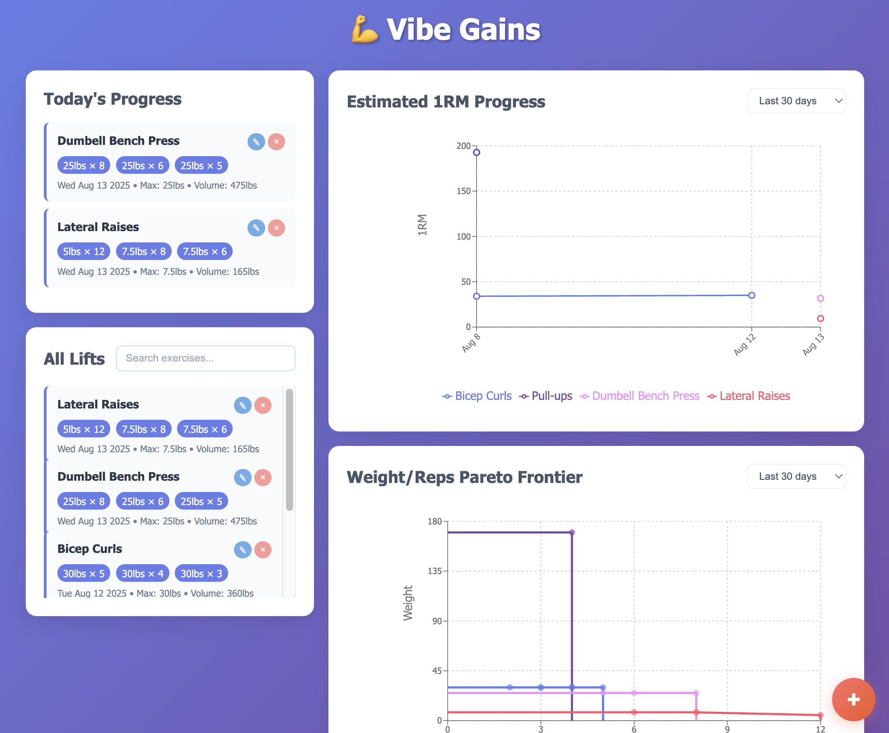

# Vibe Gains 💪

A lift tracking application that helps you monitor your strength training progress and visualize your gains over time. 

This project was 100% vibecoded by Claude. I have no idea what's going on in the code. In fact I only understand some of this README, which was also authored by Claude.



## Quick Start

```bash
# Clone and start
git clone https://github.com/alexbie98/vibe-gains.git
cd vibe-gains
./scripts/launch.sh

# Or start individually
./scripts/launch.sh frontend    # Frontend only (port 3000)
./scripts/launch.sh backend     # Backend only (port 3001)
```

Visit http://localhost:3000 to use the app and http://localhost:3001/api-docs for API documentation.

## Project Structure

```
vibe-gains/
├── frontend/                   # React + TypeScript frontend
│   ├── src/
│   │   ├── components/        # React components (Dashboard, LiftCard, etc.)
│   │   ├── context/          # React Context for state management
│   │   ├── services/         # API service layer
│   │   └── styles/           # Styled components and global styles
│   └── package.json
├── backend/                    # Node.js + Express + TypeScript API
│   ├── src/
│   │   ├── database/         # SQLite database abstraction
│   │   ├── models/           # Data models (Lift, User)
│   │   ├── routes/           # Express route handlers
│   │   ├── middleware/       # Custom middleware (logging, security)
│   │   └── docs/             # Swagger API documentation
│   └── package.json
├── data/                       # SQLite database files (git-ignored)
│   └── lifts.db               # Main application database
├── scripts/                    # Development and deployment scripts
│   ├── launch.sh              # Main launcher (dev/prod/test modes)
│   ├── backend-launch.sh      # Backend-specific operations
│   └── clear-data.sh          # Database cleanup utility
└── README.md                   # This file
```

## Available Scripts

### Testing & Utilities
- `./scripts/launch.sh test` - Run comprehensive API test suite
- `./scripts/launch.sh clear-data` - Clear all database data (with confirmation prompt)

### Individual Commands
```bash
# Frontend (React + TypeScript)
cd frontend
npm start        # Development server
npm run build    # Production build
npm test         # Run tests

# Backend (Node.js + Express + TypeScript)
cd backend
npm run dev      # Development with nodemon
npm run build    # Compile TypeScript
npm start        # Run production build
npm test         # Run tests
```

## Features

- **Track Lifts**: Record exercises with sets, weights, and reps
- **Body Weight Tracking**: Monitor body weight changes with interactive charts
- **Progress Visualization**: Charts showing strength progression and 1RM estimates over time
- **Interactive Data Management**: Hover-to-delete functionality for data points
- **Search & Filter**: Find specific exercises and date ranges with time filtering
- **Today's Summary**: Quick overview of current day's workouts
- **REST API**: Full CRUD operations with Swagger documentation

## Database

SQLite database stored in `data/lifts.db` with automatic initialization on first run.

## CI/CD & Code Quality

This project uses automated Git hooks powered by Husky to ensure code quality:

### Pre-commit Checks
Every commit automatically runs:
- **TypeScript type checking** for both frontend and backend
- **ESLint linting** for code style and best practices  
- **Complete test suite** (45 unit + integration tests)
- **Frontend tests** with Jest and React Testing Library

### Commit Message Standards
- **Conventional Commits** format recommended (e.g., `feat:`, `fix:`, `docs:`)
- Commit message validation is currently **disabled** - all messages accepted
- Recommended types: feat, fix, docs, test, chore, refactor, perf, ci, build, revert

### Running CI Checks Manually
```bash
# Run all pre-commit checks
npm run lint:frontend && npm run typecheck:frontend && npm run test:backend

# Individual checks
npm run test              # Run complete test suite
npm run lint:frontend     # Frontend linting
npm run typecheck:frontend # Frontend type checking
npm run test:backend      # Backend tests (45 tests)
```

To bypass hooks (not recommended): `git commit --no-verify`
